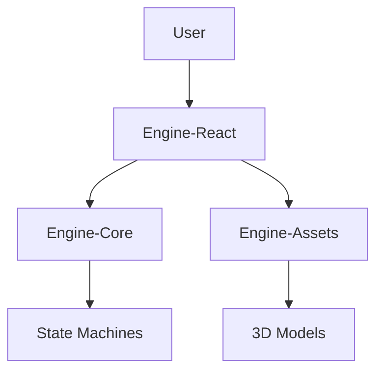

# 🏗️ Architecture Overview

This document describes the architecture of the **iPhone 17 Pro Landing Page** project. The project follows a **Monorepo** structure focused on clear separation between Logic (Core), Presentation (React/Three.js), and Resources (Assets).

## 📦 Monorepo Structure

### 1. `@packages/engine-core` (The Brain)
Responsible for all business logic, constants, and framework-agnostic state management.
- **Tech**: TypeScript, XState.
- **Responsibilities**:
  - Definition of iPhone State Machines (e.g., colors, camera animations, screen transitions).
  - Physics and Camera Constants.
  - Internationalization (Base strings).
  - Shared global types.
- **Golden Rule**: This package **must not** know that React exists.

### 2. `@packages/engine-react` (The View)
Responsible for visual rendering and interactivity.
- **Tech**: React 19, React Three Fiber (R3F), Zustand, TailwindCSS, Vite.
- **Architecture**: **Single Persistent Actor (The iPhone)**.
  - Instead of mounting/unmounting 3D models per section, we maintain a **single iPhone instance** in the scene.
  - The `land/` sections dispatch actions to the `engine-core` state machine (e.g., `SCROLL_TO_CAMERA_SECTION`).
  - The `iphone/` component reacts to these state changes, smoothly interpolating its position, rotation, and materials (GSAP/Spring).
- **Structure**:
  - `src/iphone/`: The 3D Model, Materials, and Animation Controller.
  - `src/land/`: The Sections (Hero, Features, Footer) that drive the narrative.

### 3. `@packages/engine-assets` (The Resources)
Central warehouse for heavy static files and original sources.
- **Content**:
  - 3D Models (`.blend`, `.glb`, `.gltf`).
  - Textures (4k/8k).
  - Custom Shaders (`.glsl`).
- **Usage**: `engine-react` imports or copies these files during the build.

## 🔄 Data Flow

1.  **Input**: The user interacts (scroll, click) in `engine-react`.
2.  **Action**: The event is sent to a Store (Zustand) or Machine (XState) defined in `engine-core`.
3.  **State Update**: The logic processes the transition (e.g., "Change color to Natural Titanium").
4.  **Reaction**:
    - React reacts to the state change.
    - R3F updates materials/3D animations.
    - HTML UI updates text/prices.

## 🛠️ Tooling & Build

- **Package Manager**: NPM Workspaces.
- **Build System**:
  - `engine-core`: `tsc` (TypeScript Compiler) for ESM.
  - `engine-react`: Vite (Optimized production build).
- **Linting**: ESLint Flat Config (`eslint.config.ts`) with strict TypeCheck rules.